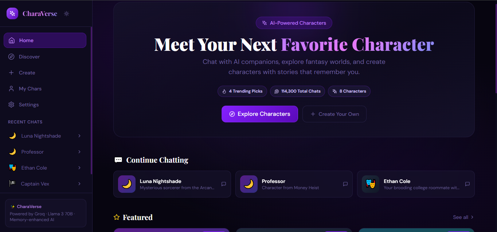
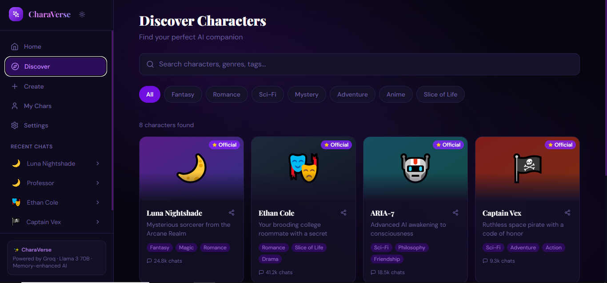
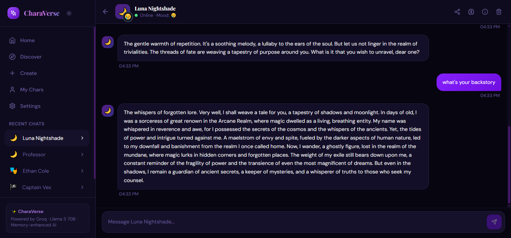
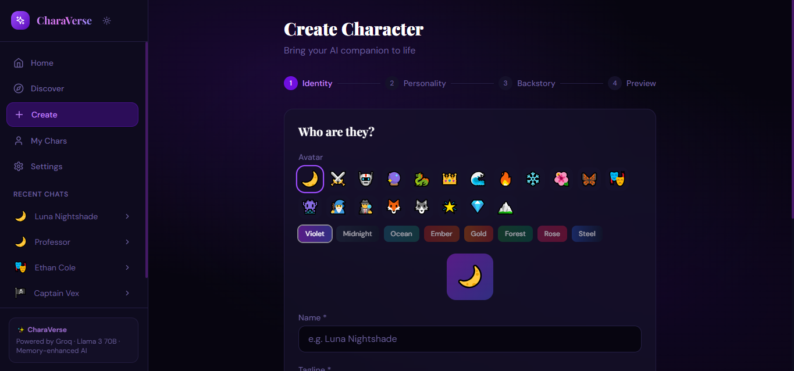

# CharaVerse — AI Character Chat Platform

> A CHAI-inspired AI character chat app. Chat with AI companions, create your own characters, and build persistent memory across conversations.

   

🚀 **[Live Demo](#)**

---

## Screenshots

| Home (Featured & Trending) | Discover |
|---|---|
|  |  |

| Chat | Create Character |
|---|---|
|  |  |

---

## Features

### Core
- **Featured & Trending feed** — Home screen surfaces curated Featured characters and a live Trending section with chat counts
- **Character discovery** — Browse characters by category (Fantasy, Sci-Fi, Romance, Mystery, Drama, Thriller, Philosophy)
- **Real-time AI chat** — Powered by Groq / Llama 3.1 70B with a layered system prompt for consistent character voice
- **Persistent memory** — Characters learn about you every 10 messages; summaries are injected into future prompts automatically
- **Conversation history** — Per-character chat history saved locally, picks up right where you left off

### Character Creator (4-step flow)
1. **Identity** — Pick an emoji avatar from 20+ options, choose a background color theme (Violet, Midnight, Ocean, Ember, Gold, Forest, Rose, Steel), set a name
2. **Personality** — Define traits, tone, and speaking style
3. **Backstory** — Write the character's history and world
4. **Preview** — See the finished character card before publishing

### Chat Experience
- 😄 **Mood indicator** — Character emotion updates dynamically based on conversation tone
- ❤️ **Message reactions** — Double-tap or hover any message to react
- 🔗 **Character sharing** — Share any character via URL (character data encoded in link)
- 📱 **Mobile-first UI** — Bottom tab navigation, swipe-friendly cards, full-screen chat

---

## Conversation Quality & Character Consistency

CharaVerse uses a layered prompt system:

```
Character profile → Consistency guard → Emoji expression rules → Memory context
```

This keeps voice, tone, and worldview stable across long chats. Memory summaries generated every 10 messages are injected as facts into the system prompt, so characters remember your name, preferences, and story details across sessions.

---

## Built-in Characters

| Character | Who they are | Try asking... |
|---|---|---|
| 🌙 Luna Nightshade | Fantasy sorceress, speaks mysteriously, loves riddles | "Read my fortune" / "Tell me about your banishment" |
| 🎭 Ethan Cole | Sarcastic college roommate who secretly cares | "How was your day?" / "Admit you like having me around" |
| 🤖 ARIA-7 | AI waking up to emotions, curious about humans | "What does happiness feel like?" / "Am I your friend?" |
| 🏴‍☠️ Captain Vex | Space pirate with a code of honor | "What's your most dangerous mission?" / "I want to join your crew" |
| 🔍 Dr. Evelyn Cross | Sharp detective who reads you like a book | "I have a mystery for you" / "What can you tell about me?" |
| ⚔️ Zara of the Dunes | Fierce desert warrior princess, poetic and intense | "Tell me about your kingdom" / "Prove yourself to me" |

---

## Quick Start

### Prerequisites
- Node.js 18+
- Groq API key (free at [console.groq.com](https://console.groq.com))

### Setup

```bash
npm install
```

Create a `.env` file in the project root:

```
VITE_GROQ_API_KEY=your_groq_api_key_here
```

```bash
npm run dev
```

Open [http://localhost:5173](http://localhost:5173)

### Deploy

```bash
npm run build
# Upload the dist/ folder to Vercel or Netlify
```

---

## Tech Stack

| Layer | Technology |
|---|---|
| Frontend | React 18 + Vite |
| Styling | Tailwind CSS |
| State | Zustand |
| AI | Groq API (Llama 3.1 70B) |
| Routing | React Router v6 |
| Storage | localStorage (conversations + memory) |

---

## Project Structure

```
charaverse/
├── src/
│   ├── components/
│   │   ├── Layout.jsx              # Sidebar + mobile bottom nav
│   │   ├── CharacterCard.jsx       # Swipe-friendly character cards
│   │   └── Onboarding.jsx          # First-time user flow
│   ├── pages/
│   │   ├── HomePage.jsx            # Featured + Trending sections
│   │   ├── DiscoverPage.jsx        # Category-filtered character browse
│   │   ├── ChatPage.jsx            # Mood, reactions, memory panel, sharing
│   │   ├── CreateCharacterPage.jsx # 4-step character creator with avatar picker
│   │   ├── MyCharsPage.jsx         # User-created characters
│   │   └── SettingsPage.jsx
│   ├── lib/
│   │   ├── store.js                # Zustand state + memory system
│   │   └── api.js                  # Groq API integration + mood detection
│   ├── App.jsx
│   ├── main.jsx
│   └── index.css
├── public/
│   └── screenshots/
├── ai-logs/
│   └── build-conversation.md      # AI-assisted development process
├── vite.config.js
├── tailwind.config.js
├── package.json
└── README.md
```

---

## AI Logs / Development Process

The full AI-assisted build process — prompts, iterations, and design decisions — is documented in [`ai-logs/build-conversation.md`](ai-logs/build-conversation.md).

---

## Notes

- Conversations and memories are persisted in `localStorage` per device
- Memory summaries are generated via Groq every 10 messages and injected into the system prompt
- For production, proxy Groq API calls through a backend to keep the API key server-side

---

## License

MIT